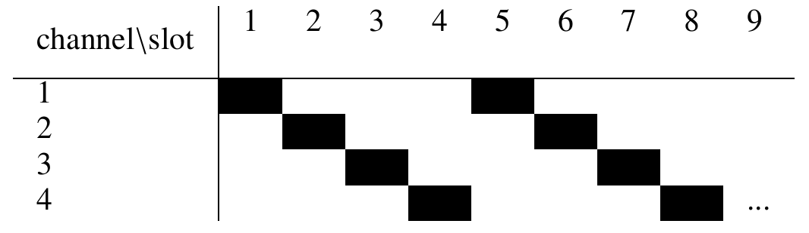

ns3-gym
============

[OpenAI Gym](https://gym.openai.com/) is a toolkit for reinforcement learning (RL) widely used in research. The network simulator [ns-3](https://www.nsnam.org/) is the de-facto standard for academic and industry studies in the areas of networking protocols and communication technologies. ns3-gym is a framework that integrates both OpenAI Gym and ns-3 in order to encourage usage of RL in networking research.

Installation
============

1. Install all required dependencies required by ns-3.
```
# minimal requirements for C++:
apt-get install gcc g++ python

see https://www.nsnam.org/wiki/Installation
```
2. Install ZMQ and Protocol Buffers libs:
```
# to install protobuf-3.6 on ubuntu 16.04:
sudo add-apt-repository ppa:maarten-fonville/protobuf
sudo apt-get update

apt-get install libzmq5 libzmq5-dev
apt-get install libprotobuf-dev
apt-get install protobuf-compiler
```
3. Configure and build ns-3 project (if you are going to use Python virtual environment, please execute these commands inside it):
```
# Opengym Protocol Buffer messages (C++ and Python) are build during configure
./waf configure
./waf build
```

4. Install ns3gym located in model/ns3gym (Python3 required)
```
pip3 install ./model/ns3gym
```

5. (Optional) Install all libraries required by your agent (like tensorflow, keras, etc.).

6. Run example:
```
cd ./scratch/opengym
./simple_test.py
```

7. (Optional) Start ns-3 simulation script and Gym agent separately in two terminals (useful for debugging):
```
# Terminal 1
./waf --run "opengym"

# Terminal 2
cd ./scratch/opengym
./test.py --start=0
```

Examples
========

All examples can be found [here](./examples/).

## Basic Interface

1. Example Python script. Note, that `gym.make('ns3-v0')` starts ns-3 simulation script located in current working directory.
```
import gym
import ns3gym
import MyAgent

env = gym.make('ns3-v0')
obs = env.reset()
agent = MyAgent.Agent()

while True:
  action = agent.get_action(obs)
  obs, reward, done, info = env.step(action)

  if done:
    break
env.close()
```
2. Any ns-3 simulation script can be used as a Gym environment. This requires only to instantiate OpenGymInterface and implement the ns3-gym C++ interface consisting of the following functions:
```
Ptr<OpenGymSpace> GetObservationSpace();
Ptr<OpenGymSpace> GetActionSpace();
Ptr<OpenGymDataContainer> GetObservation();
float GetReward();
bool GetGameOver();
std::string GetExtraInfo();
bool ExecuteActions(Ptr<OpenGymDataContainer> action);
```
Note, that the generic ns3-gym interface allows to observe any variable or parameter in a simulation.

A more detailed description can be found in our [Technical Report](https://arxiv.org/pdf/1810.03943.pdf).

## Cognitive Radio
We consider the problem of radio channel selection in a wireless multi-channel environment, e.g. 802.11 networks with external interference. The objective of the agent is to select for the next time slot a channel free of interference. We consider a simple illustrative example where the external interference follows a periodic pattern, i.e. sweeping over all channels one to four in the same order as shown in the table.

<p align="center">

</p>

We created such a scenario in ns-3 using existing functionality from ns-3, i.e. interference created using `WaveformGenerator` class and sensing performed using `SpectrumAnalyzer` class.

Such a periodic interferer can be easily learned by an RL-agent so that based on the current observation of the occupation on each channel in a given time slot the correct channel can be determined for the next time slot avoiding any collision with the interferer.

Our proposed RL mapping is:
- observation - occupation on each channel in the current time slot, i.e. wideband-sensing,
- actions - set the channel to be used for the next time slot,
- reward - +1 in case of no collision with interferer; otherwise -1,
- gameover - if more than three collisions happened during the last ten time-slots

The figure below shows the learning performance when using a simple neural network with fully connected input and an output layer.
We see that after around 80 episodes the agent is able to perfectly predict the next channel state from the current observation hence avoiding any collision with the interference.

The full source code of the example can be found [here](./examples/interference-pattern/).

<p align="center">

</p>

Note, that in a more realistic scenario the simple waveform generator in this example can be replaced by a real wireless technology like LTE unlicensed (LTE-U).


## RL-TCP
The proper RL-TCP agent example is still under development. However, we have already implemented and released two versions (i.e. time and event-based) of an interface allowing to monitor parameters of a TCP instance and control its `Congestion Window` and `Slow Start Threshold` -- see details [here](./examples/rl-tcp/tcp_base.py). Note, that both versions inherits from `TcpCongestionOps` and hence can be used as an argument for `ns3::TcpL4Protocol::SocketType`.

Moreover, using the event-based interface, we already have an example Python Gym agent that implements TCP NewReno and communicates with the ns-3 simulation process using ns3gym -- see [here](./examples/rl-tcp/tcp_newreno.py). The example can be used as a starting point to implement an RL-based TCP congestion control algorithms.

In order to run it, please execute:
```
cd ./scratch/rl-tcp
./test_tcp.py
```

Or in two terminals:
```
# Terminal 1:
./waf --run "rl-tcp --transport_prot=TcpRl"

# Terminal 2:
cd ./scratch/rl-tcp/
./test_tcp.py --start=0
```

Note, that our Python TCP NewReno implementation achieves the same number of transmitted packets like the one implemented in ns3 (see the output of ns-3 simulation, i.e. `RxPkts: 5367` in both cases). Please execute the following command to cross-check:
```
./waf --run "rl-tcp --transport_prot=TcpNewReno"
```

Contact
============
* Piotr Gawlowicz, TU-Berlin, gawlowicz@tkn
* Anatolij Zubow, TU-Berlin, zubow@tkn
* tkn = tkn.tu-berlin.de

How to reference ns3-gym?
============

Please use the following bibtex :

```
@article{ns3gym,
  author    = {Gawlowicz, Piotr and Zubow, Anatolij},
  title     = {{ns3-gym: Extending OpenAI Gym for Networking Research}},
  journal   = {CoRR},
  year      = {2018},
  url       = {https://arxiv.org/abs/1810.03943},
  archivePrefix = {arXiv},
}
```
